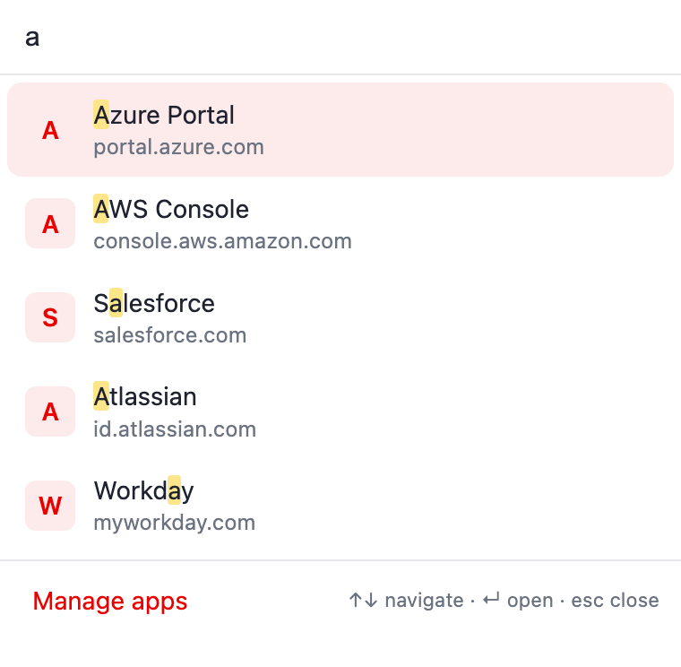
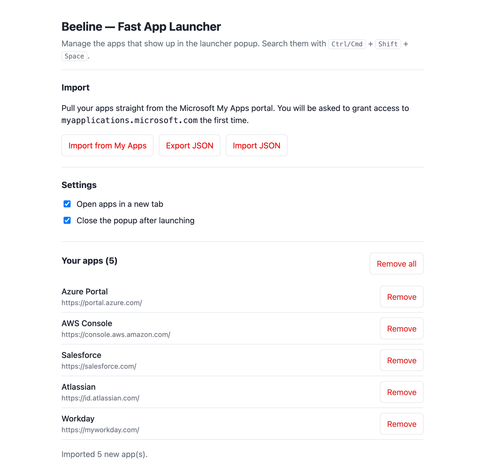

# Beeline — Fast App Launcher

A fast, keyboard-first launcher for your **Microsoft My Apps / Entra** single
sign-on apps — a lightweight, modern alternative to the official _My Apps Secure
Sign-in_ extension's app portal.

Runs on **Chrome** (and other Chromium browsers such as Edge, Brave and Vivaldi)
**and on Firefox** — one codebase, two builds.

Press **`Ctrl/Cmd` + `Shift` + `Space`**, type a few letters, hit **Enter** —
the app opens through your existing SSO. No backend, no telemetry, no waiting.
(The key is yours to change, and **Manage apps** shows the one your browser
actually has bound.)

> **Scope.** Beeline is an app _launcher_. It does **not** replicate Entra's
> password vaulting / credential auto-fill — that backend is Microsoft-proprietary
> and can't be cloned client-side. Apps open via their normal SSO flow.

## Table of Contents

- [Features](#features)
- [Visuals](#visuals)
- [Installation](#installation)
- [Usage](#usage)
- [Development](#development)
- [Architecture](#architecture)
- [Publishing](#publishing)
- [Privacy](#privacy)
- [Conventions](#conventions)
- [Author & License](#author--license)

## Features

- ⚡ **Instant** — pure, dependency-free logic renders the list straight from
  local storage; no network round-trip on open.
- ⌨️ **Keyboard-first** — fuzzy search, `↑`/`↓` to navigate, `Enter` to launch,
  `Esc` to clear/close. Matched letters are highlighted.
- 🧠 **Learns your habits** — frequently and recently launched apps float to the
  top.
- 📥 **Import from My Apps** — one click pulls your tiles from
  `myapplications.microsoft.com` (host permission requested only then), plus
  manual add, inline **edit**, and JSON import/export.
- 🔄 **Stays in sync** — re-scrapes whenever you visit My Apps (and on a periodic
  background check), adding new apps and removing ones you no longer have; your
  manually-added apps are always kept. A read that did not make it to the end of
  the (virtualised) grid can only ever add — nothing is removed on a partial
  view of your portal.
- 🔖 **Bookmarks too — if you want** — switch on _"Also search this browser's
  bookmarks"_ in the settings and your bookmarks join the search results
  (labelled, and ranked just below an app of the same relevance). Off by
  default; the `bookmarks` permission is only requested when you switch it on,
  and handed back when you switch it off.
- 🖼️ **Icons that are actually there** — an imported tile brings its logo with
  it; bookmarks, apps with no logo in your tenant, and apps you added by hand
  borrow the icon your browser has already cached locally, and fall back to the
  app's initial when even that is empty.
- 🔎 **Fallback search** — when nothing matches what you typed, hit Enter to
  search My Apps or your default web search engine (configurable in settings).
- 🔒 **Private by design** — everything stays in your browser; no telemetry. Host
  access to `myapplications.microsoft.com` is requested only when you first
  import or sync.

## Visuals

### Launcher popup



### Manage apps



The icon is a generated rounded gradient tile (`npm run icons`). The 1280×800
store screenshot lives in [docs/store/](docs/store/screenshot-1280x800.png).

## Installation

### From the stores

| Browser                                  | Install                                                                                       |
| ---------------------------------------- | --------------------------------------------------------------------------------------------- |
| Chrome / Edge / Brave / other Chromium   | [Chrome Web Store](https://chromewebstore.google.com/detail/ahcijedndjdoigcipppnkklgmlndkhka) |
| Firefox (desktop **140+**, Android 142+) | [Firefox Add-ons (AMO)](https://addons.mozilla.org/firefox/addon/beeline-fast-app-launcher/)  |

### From source (development)

```bash
git clone git@github.com:sapn95/myapps-launcher.git
cd myapps-launcher
npm install
npm run build           # -> dist/          (Chrome / Chromium)
npm run build:firefox   # -> dist-firefox/  (Firefox)
```

- **Chrome:** `chrome://extensions` → enable **Developer mode** → **Load
  unpacked** → select the `dist/` folder.
- **Firefox:** `about:debugging#/runtime/this-firefox` → **Load Temporary
  Add-on** → pick `dist-firefox/manifest.json`.

### Browser differences

One source tree builds both; `scripts/build.mjs --firefox` swaps in the two
things Firefox needs — an **event-page** background (Firefox's stable MV3
background, instead of a service worker) and a
`browser_specific_settings.gecko` id (required for `storage.sync` and AMO
signing). The only functional difference: the web-search fallback opens
DuckDuckGo on Firefox, because Firefox has no `chrome.search.query` to hand the
query to your default engine. Import, sync, alarms, themes and the AWS-region
deep link behave identically.

## Usage

1. Open **Manage apps** (the extension opens it automatically on first install).
2. Click **Import from My Apps** (sign in to My Apps first), or **Add an app**
   manually, or **Import JSON**.
3. Open the launcher with the toolbar button or **`Ctrl/Cmd` + `Shift` +
   `Space`**, type, and press **Enter**.

Settings cover new-tab vs. current-tab, whether the popup closes after
launching, the fallback search, an AWS region to deep-link consoles into, the
theme (auto / light / dark), and whether bookmarks join the search. The same
page shows the launcher's current keyboard shortcut and links to where the
browser lets you rebind it.

## Development

```bash
npm install
npm run lint            # eslint
npm run format          # prettier --write
npm test                # vitest
npm run test:coverage   # vitest + coverage gate (all of src/)
npm run icons           # regenerate src/icons/*.png
npm run build           # -> dist/          (Chrome)
npm run build:firefox   # -> dist-firefox/  (Firefox)
npm run package         # both builds + myapps-launcher[-firefox]-vX.Y.Z.zip
npm run ci              # lint + format:check + coverage + package (both browsers)
```

The unit-tested core lives in [`src/lib/`](src/lib/); the UI glue
(`popup`, `options`, `background`) is covered by jsdom tests against a fake
`chrome.*` API. CI runs on every pull request and on pushes to `main` via
[`.github/workflows/ci.yml`](.github/workflows/ci.yml): lint, format, the
coverage gate, both browser builds, and `web-ext lint` on the Firefox build.

Dependency updates come from Dependabot (weekly, one grouped PR per ecosystem)
and merge themselves via
[`.github/workflows/dependabot-auto-merge.yml`](.github/workflows/dependabot-auto-merge.yml)
— but only after both CI checks have gone green on that exact commit, and only
while every commit on the branch is Dependabot's own.

## Architecture

See [docs/architecture.md](docs/architecture.md) for the component diagram,
storage layout, and design rationale.

## Publishing

Tagging `vX.Y.Z` triggers [`.github/workflows/release.yml`](.github/workflows/release.yml),
which builds and tests both browser packages, creates a GitHub release, publishes
to the **Chrome Web Store**, and signs + submits the **Firefox** build to
**addons.mozilla.org** (each store step is skipped with a warning while its
credentials are absent).

The same workflow also runs **on the 1st of every month** and releases by
itself — but only when both conditions hold: something under `src/` or
`scripts/` actually changed since the last tag (no shipping byte-identical
builds through store review), and lint, formatting and the full test suite are
green. The version bump follows Conventional Commits since the last tag:
`feat:` → minor, a `!`/`BREAKING CHANGE` → major, anything else → patch.

Full setup — including the one-time manual first submission per store and how to
generate the credentials — is in [docs/publishing.md](docs/publishing.md).

## Privacy

Beeline stores your app list and launch counts in local browser storage, and a
few small settings in browser sync storage (Chrome sync / Firefox Sync). It
makes **no external network calls** of its own and contains **no analytics or
telemetry** — site icons come from the browser's own local cache, not from a
favicon service. The only host access is `myapplications.microsoft.com`, used on
demand to import/sync your own app tiles.
Full details are in [PRIVACY.md](PRIVACY.md).

## Conventions

- **Commits:** Conventional Commits + SemVer.
- **Quality gates:** pre-commit secret scanning (ggshield, detect-private-key,
  detect-aws-credentials), ESLint, and Prettier.
- **Tests:** Vitest with a coverage gate over all of `src/` (≥ 80%; the
  `src/lib/` core additionally ≥ 95% statements/lines/functions and ≥ 85%
  branches), plus source security checks (no hardcoded keys, no plain-http URLs,
  no disabled TLS).
- **Docs:** kept in-repo (README + `docs/`); commit history is the record (no
  `CHANGELOG.md`).

## Author & License

Created by Sebastian Winterberger ([@sapn95](https://github.com/sapn95)).
Licensed under the [MIT License](LICENSE).
