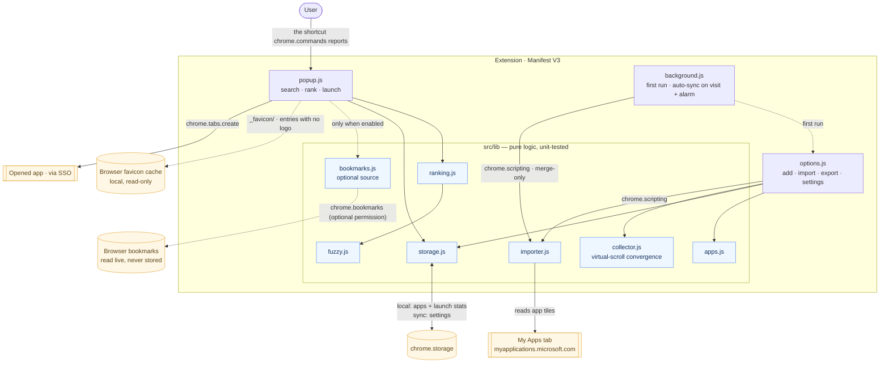
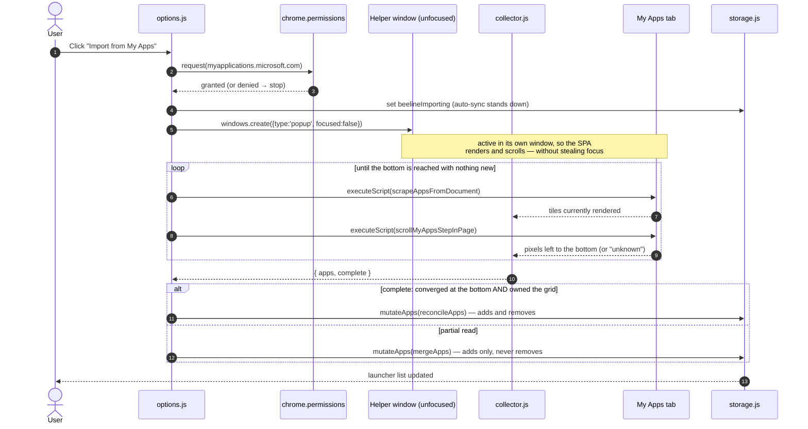

# Architecture

Beeline is a Manifest V3 Chrome extension with **no runtime dependencies** and
no build-time bundler — the source under `src/` is the artifact. `npm run build`
just copies `src/` into `dist/` and stamps the manifest version.

> Diagrams use Mermaid — it renders natively on GitHub.

## Components

## Import flow

The portal **virtualises** its tile grid: only ~140 tiles exist in the DOM at any
moment, swapped as you scroll. A single scrape therefore sees a slice, never the
list — so the import scrolls and accumulates the union until the grid bottoms
out, and only a run that converged there is allowed to remove anything.

## Why this shape

- **The `src/lib/` core is pure** — no `chrome` APIs or DOM globals in the hot
  path — so it is fully unit-testable and carries the coverage gate (see
  `vitest.config.js`). UI glue (`popup`, `options`, `background`) is thin and
  verified by load-unpacked smoke testing.
- **A container is part of an app's identity, not a launch option.** (Firefox
  only; Chrome has no counterpart and every entry point in `lib/containers.js`
  answers "there are no containers" rather than throwing.) `appId` folds the
  cookie store id in, so the same My Apps tile read from two containers is two
  apps that sign in as two different people. An app with no container hashes
  exactly as before, so no existing id moves and no launch history is orphaned.
  The consequence that matters is on the REMOVAL side: a scrape only ever sees
  one container's My Apps, so `reconcileApps`, `applySyncRead` and
  `isSuspectRead` are all scoped to it. The import compares the container its
  helper window _really_ opened in against the one that was picked and refuses
  to prune on a mismatch; the background sync takes its scope from the tab it
  read, skips private windows, and will not act on a scope that owns no apps —
  in EITHER direction, because adopting a container and re-adding a
  container-only list as container-less are the same duplication bug mirrored.
- **The periodic sweep is per container, one walk at a time.** Syncing whichever
  My Apps tab sorted first left every other container to go stale; two walks on
  one virtualised grid make each other skip slices, which is precisely the short
  read the removal rails exist to distrust. A walk that finds the lock held is
  queued rather than dropped — it can hold for 90 s per container, and the visit
  sync it would otherwise discard is the only trigger allowed to remove
  anything.
- **Removal earns its confidence over time, not in one read.** The manual Import
  is the user watching a full walk of the grid, so it reconciles outright. The
  automatic sync runs unattended and cannot be that sure, so it never deletes on
  the strength of a single read: an app it fails to find collects a strike
  (`applySyncRead`), and only a second consecutive miss removes it — being seen
  again clears the count. Two further rails sit in front of that. A read missing
  an implausible slice of the known list is thrown away whole (`isSuspectRead`),
  which is what stops a read that stalls in the SAME place every time from lining
  its misses up into a deletion. And a read of a tab that is not the active one
  may only ever add, because a background My Apps throttles rendering of its
  virtualised grid and would come back short through nobody's fault.
- **A partial read may never delete.** `accumulateApps()` reports `complete`
  only when the grid reached its bottom and produced nothing new for several
  consecutive rounds. Anything else — a timeout, the no-growth safety cap, a
  scroll container the page won't let us drive — merges and never prunes. The
  scroll step is equally careful about what counts as "the bottom": a document
  height the window cannot actually scroll is ignored (an app shell reports one
  permanently), while a **tile-bearing** scroller that claims room left and
  refuses to move reports "unknown", because the tiles it is hiding are exactly
  the ones a reconcile would delete.
- **Least privilege.** The manifest requests only `storage`, `scripting`,
  `alarms`, `search` and `favicon` — the last reads the browser's local icon
  cache for entries that carry no logo, and makes no network request.
  Access to `myapplications.microsoft.com` is an _optional_ host permission,
  requested the moment the user clicks **Import from My Apps** and never before.
  `bookmarks` is likewise _optional_: requested from inside the click that ticks
  the setting, and `permissions.remove`d when it is unticked. An install
  therefore grants neither.
- **Bookmarks are a source, not data.** They are read live from
  `chrome.bookmarks` each time the popup opens and never written to storage — so
  there is nothing to sync, nothing to prune, and a revoked permission simply
  makes them disappear (the API is gone, `loadBookmarkItems()` returns `[]`).
  They join the ranking only once a query is typed, carry a small constant
  handicap so an app always wins a tie, and a bookmark whose URL is already an
  app is dropped.
- **Icons come from the tile first, the browser second.** A scraped tile brings
  its own logo, which is stored with the app. Everything else — bookmarks, apps
  whose tenant uploaded no logo, hand-added apps — falls back to the local
  favicon cache, and to the app's initial if that has nothing either. My Apps
  launcher links deliberately skip the favicon step: they all share one host, so
  it would paint the identical glyph on every row and say less than a letter.
- **The importer is injected, not bundled.** `scrapeAppsFromDocument` is passed
  to `chrome.scripting.executeScript({ func })`, so it must stay self-contained
  (no imports). It is exported only so the unit test can run it against a jsdom
  fixture.
- **Stable identity.** Each app's id is an FNV-1a hash of its canonical URL, so
  re-importing never duplicates an app and launch stats survive re-imports. A
  bookmark hashes its **full** URL instead (`bookmarkKey`, prefixed `bm:`):
  dropping the fragment there would collapse two hash-routed destinations —
  Azure Portal blades, Power BI report pages — into one row.

## Storage layout

| Key        | Area    | Contents                                             | Why                                      |
| ---------- | ------- | ---------------------------------------------------- | ---------------------------------------- |
| `apps`     | `local` | curated app list                                     | an import pulls 100+ apps (see the note) |
| `stats`    | `local` | per-app `{count, lastLaunched}`                      | high-write, device-specific              |
| `settings` | `sync`  | tab behaviour, fallback search, AWS region, theme, … | small, user-level                        |

> NOTE: `apps` lives in `local` on purpose. `chrome.storage.sync` has an ~8 KB
> **per-item** quota, and a My Apps import of 100+ apps blows straight past it —
> `set()` then fails and the import silently loses everything. `local` has a
> ~10 MB budget. The price is that the app list does not follow you to another
> machine; Export/Import JSON is the way across.

## Data flow: ranking

`rankApps(apps, query, now, stats)` scores each app as
`fuzzyScore(name) + usageBoost(stats)`, falling back to a (weighted) host match
when the name doesn't match, then sorts best-first with an alphabetical
tiebreak. Matched character positions are returned so the popup can `<mark>`
them. Items tagged `source: 'bookmark'` lose a small constant, so an app of
equal relevance always ranks first.
